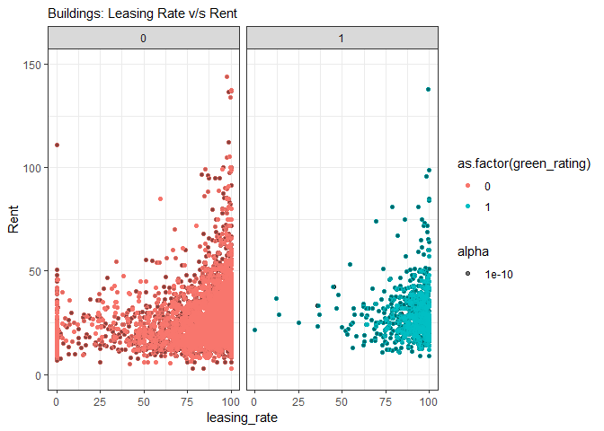
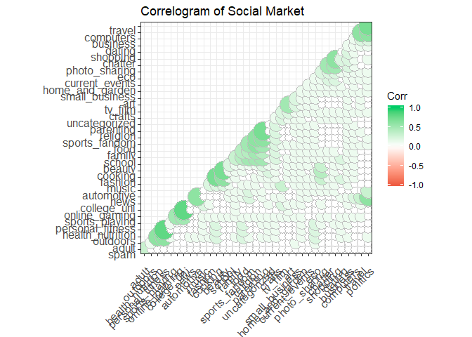

Exercises 1
================
Avani Sharma
8 August 2018

### Probability practice

#### Part A.

RC = Random Clicker
TC = Truthful Clicker

Two possible answers to the survey: Yes(Y) and No(N)

-   P(Y/RC) = 0.5 =&gt; Probability of Yes given that person is random clicker
-   P(N/RC) = 0.5 =&gt; analogous
-   P(RC) = 0.3 =&gt; Probability of being random clicker
-   P(TC) = 0.7 =&gt; analogous
-   P(Y) = 0.65 =&gt; Probability of Yes
-   P(N) = 0.35 =&gt; analogous

-   P(Y) = P(Y/RC) x P(RC) + P(Y/TC) x P(TC)
-   0.65 = 0.5 x 0.3 + P(Y/TC) x 0.7

-   P(Y/TC) = 0.5/0.7 = 0.7142857

Fraction of people who are truthful clickers and answered yes = 0.7142857 = 71.4%

#### Part B.

-   Sensitivity is 0.993, i.e if someone has the disease, there is a probability of 0.993 that they will test positive
-   Specificity is 0.9999, i.e if someone doesn't have the disease, there is probability of 0.9999 that they will test negative

-   Incidence of the disease is reasonably rare = 0.0025%

-   Let's take a sample of population = 1000000

-   Diseased people = 25

Sensitivity = Tested Positive with disease/Diseased people = 0.993 Tested Positive with disease = 25\*0.993 = 24.825 (Ignore decimal as it will vanish while taking ratio)

Specificity = Tested Negative & didn't have disease/Healthy Individuals = 0.9999 Tested Negative & didn't have disease = (1000000-25)\*0.9999 = 999875.0025

Complete Truth Table:

| Predicted         | Diseased | Healthy    |
|-------------------|----------|------------|
| Diseased (Actual) | 24.825   | 0.175      |
| Healthy (Actual)  | 24.975   | 999975.025 |

Someone tests positive, the probability that they have the disease (seeing from table above) = 24.825/(24.825+99.9975) =0.19888

Someone tests negative, the probability that they have the disease (seeing from table above) = 0.007

If we implement the above test we can predict that the person has a disease with 19.88% probability, that is we might give false alarms to many people. The probabiltiy is too low to be implemented on a universal scale. The probabilty to declare correct healthy people and diseased people is high but the probability of diseased person to have positive test for is too low 19.88%. ~80% of times we will mispredict and give false alarms.

Exploratory analysis: green buildings
-------------------------------------

#### Austin Real-Estate Case Study :Data Exploration

###### General Correlation plot

``` r
data_1<-read.csv("data/greenbuildings.csv")
library(ggplot2)
library(ggcorrplot)
library(ggthemes)

data_1<-data_1[complete.cases(data_1),]
#install.packages("devtools")
#devtools::install_github("kassambara/ggcorrplot")

# Correlation matrix
corr <- round(cor(data_1), 1)

# Plot
ggcorrplot(corr, hc.order = TRUE, 
           type = "lower", 
           lab = TRUE, 
           lab_size = 3, 
           method="circle", 
           colors = c("tomato2", "white", "springgreen3"), 
           title="Correlogram of Green Buildings", 
           ggtheme=theme_bw)+theme(axis.text.x = element_text(angle=45, vjust=0.9))+theme(axis.text.y = element_text(angle=0, vjust=0.9))
```


We start with a basic correlation plot, the plot here has all correlation values but colored with bubbles according to the positive or negative correlation. The sizes are proportional to the magnitude of the correlation.

Observations:

1.  Good correlation (&gt;0.5) between seemingly similar variables is expected (like hd\_total07 & total\_dd\_07), (age & renovated), (size & stories), (total\_dd\_07 & electricity costs), (green-rating & energy costs) etc.

2.  The rest are very weakly correlated and hence there seems not much of a dependent relationship between the variables

##### Comparison of distribution of greeen and non-green buildings

``` r
g <- ggplot(data_1, aes(x=as.factor(green_rating), y=leasing_rate))
g + geom_boxplot(aes(fill=factor(green_rating))) + 
  theme(axis.text.x = element_text(angle=0, vjust=0.6)) + 
  labs( 
       subtitle="Leaisng Rate v/s Green Rating",
       caption="Source: Green Buildings",
       x="Green Rating",
       y="Leasing rate")
```


Observations: (0: Non-green & 1: Green)

1.  A lot of the non green building have very low leasing rate (&lt;50%), there are more number of outliers in case of non green buildings as can be seen from points below 50% in box plot.

2.  The 50th percentile of green building lies at about 90%. The leasing rate of of green buildings above 50th percentile is between 90 to close to 100%. The non-green have comparatively low 50th percentile leasing rate.

3.  The proportion of green and non green buildings is low as each cluster had only one green building.

##### Renovated Buildings

There are almost equal number of renovated and non-renovated buildings as can be seen from density plots. Renovated buildings are slightly lower in numbers though.

``` r
library(ggplot2)
theme_set(theme_classic())

# Plot
g <- ggplot(data_1, aes(renovated))
g + geom_density(aes(fill=factor(renovated)), alpha=0.8) + 
  labs(subtitle="Buildings grouped by Renovation",
       caption="Source: Green Building",
       x="Renovated (0,1)",
       fill="Renovated")
```

 \#\#\#\#\# Leaisng Rate v/s Rent

``` r
theme_set(theme_bw())  # pre-set the bw theme.
g <- ggplot(data_1, aes(leasing_rate, Rent)) + geom_point()+
  labs(subtitle="Buildings: Leasing Rate v/s Rent")+facet_grid('green_rating')+ylim(0,150)

g + geom_jitter(aes(col=as.factor(green_rating), alpha=0.0000000001))
```

 Observations:

1.  We see high Leasing Rate have generally competitive prices concentrated between ~ 15$ to 50.*B**u**t**o**n**l**y**f**e**w**o**f**t**h**e**g**r**e**e**n**b**u**i**l**d**i**n**g**s**g**o**b**e**y**o**n**d*50.

2.  Most of the green buildings are concentrated towards high leasinging rate while non-green buildings are relatively scattered.

##### Rent Distribution

``` r
g <- ggplot(data_1, aes(Rent))
g + geom_histogram(col='#FF7034', fill='#FF7034',alpha=0.1) + 
  theme(axis.text.x = element_text(angle=0, vjust=0.6)) + 
  labs( 
       subtitle="Rent Distribution",
       caption="Source: Green Buildings",
       x="Rent",
       y="Frequency")
```

    ## `stat_bin()` using `bins = 30`. Pick better value with `binwidth`.


Most of the buildings have rate between 0-50$

##### Cluster Rent v/s Size

``` r
theme_set(theme_bw())  # pre-set the bw theme.
g <- ggplot(data_1, aes(cluster_rent, size)) + 
  labs(subtitle="Cluster Rent v/s Size")

g + geom_point(aes(col=as.factor(green_rating),alpha=0))
```


Most of the cluster rents are concentrated bewteen 10-40$ per square feet.

##### Employment Growth v/s cluster

``` r
g <- ggplot(data_1, aes(empl_gr))
g + geom_histogram(col="#40E0D0", fill="#40E0D0", alpha=0.1) + 
  theme(axis.text.x = element_text(angle=0, vjust=0.6)) + 
  labs( 
       subtitle="Employment Growth Distribution",
       caption="Source: Green Buildings",
       x="Employment Growth",
       y="Frequency")
```

    ## `stat_bin()` using `bins = 30`. Pick better value with `binwidth`.


Employment growth is mostly static at around 2-5%

#### Numerical Analysis

I followed the path where I took the financial information of the data-frame and then analysed the same. I have a feeling since excel is a very powerfull tool there can be a lot that can be done, gross generalisations with excel is perhaps not that good idea.

``` r
library(data.table)
data_1<-data.table(data_1)
data_fin<-data_1[,c("CS_PropertyID", "cluster", "size", "Rent", "leasing_rate", "green_rating", "net", "Precipitation", "Gas_Costs", "Electricity_Costs")]
head(data_fin)
```

    ##    CS_PropertyID cluster   size  Rent leasing_rate green_rating net
    ## 1:        379105       1 260300 38.56        91.39            1   0
    ## 2:        122151       1  67861 28.57        87.14            0   0
    ## 3:        379839       1 164848 33.31        88.94            0   0
    ## 4:         94614       1  93372 35.00        97.04            0   0
    ## 5:        379285       1 174307 40.69        96.58            0   0
    ## 6:         94765       1 231633 43.16        92.74            0   0
    ##    Precipitation  Gas_Costs Electricity_Costs
    ## 1:         42.57 0.01370000        0.02900000
    ## 2:         42.57 0.01373149        0.02904455
    ## 3:         42.57 0.01373149        0.02904455
    ## 4:         42.57 0.01373149        0.02904455
    ## 5:         42.57 0.01373149        0.02904455
    ## 6:         42.57 0.01373149        0.02904455

data\_f has now all variables that can impact our buying & maintenance cost of the green building.

The following are my counter-arguements for the path that the statistician took:

1.  He just removed the buildings that had less than 10% leasing rate, during exploration of the data I found that less than 10% leasing rate was more prominent in case of non-green rated buildings as was seen from Plot 2 too. For green rated buildings most of the data points actually had a pretty good leasing rate in between 75-98%. I feel to understand the green rating buildings, distribution of data points is an important part of the analysis.

2.  He took the median rate of the entire non-green & green data set, there are two reasons I feel that is flawed:

<!-- -->

1.  The cluster in which the building is a big deciding factor in analysing the rate. there are few clusters in which I feel there is a lot of variation between green and non-green buildings. The fact that he discared the cluster specific behaviour is something that I don't agree with. Each cluster describes a geography that can be a potential good/bad investment for the investor.

2.  Also, the per square foot area that he took, the fact is all the buildings are not completely occupied. The leasing rate defines the percentage of occupation which again varies as per the cluster even in case of green buildings. So, the effective square per foot rent the realtor would get will be product of leasing rent and rent per square foot. The fact that both green and green buildings vary hugely in this respect (seen from plot 2) reinstates the fact that it will be a prominent part of our analysis.

3.  Also instead of a gross generalisation I would like to analyse each cluster separately instead of the entire dataset together.

<!-- -->

1.  Now there is a variable net which is an indicator as to whether the rent is quoted on a \`\`net contract'' basis. Tenants with net-rental contracts pay their own utility costs, which are otherwise included in the quoted rental price. I would intend to include the same in my analysis.

The analysis that I would suggest:

1.  I would first calculate the effective rent per square foot per building, the effective rent would be product of leasing rent and rent per square foot.

2.  The effective rent above is calculated for both green and non green buildings. I use median again because it helps in avoiding outliers. For the median I used all the non-green buildings separately, the reason being that the cluster rent also includes the green building. Also, it is essential to compare the green with the non-green building median and not the overall measures of central tendency (mean/median/mode). In addition to above I also included the electricity and water costs for only 'net' flagged buildings.

3.  Now for each cluster I calculated the above and aligned the same with each cluster's green building. The difference between the green and non-green rent is something that I would analyse in order to understand whether having the green building is overall profitable and in how many days we can recuperate the investment.

The analysis below supports the arguements I made above. Here I took median adjusted rent (leasing\_rate\*rent) of separate clusters among non-green building only as we need to comapre green v/s non-green. Median is a better representation than mean as it handles outliers.

``` r
library(data.table)
data_1<-data.table(data_1)
data_1$Rent_actual=data_1$Rent*data_1$leasing_rate/100
data_1a<-data_1[green_rating==0,.(cluster_rent_Actual=median(Rent_actual)), by=.(cluster)]
data_1_merge<-merge(x = data_1, y = data_1a, by = "cluster", all.x = TRUE)
data_1_merge<-data_1_merge[complete.cases(data_1),]
data_1_merge$Difference_in_Rents=data_1_merge$Rent_actual-data_1_merge$cluster_rent_Actual
data_1_merge<-data_1_merge[complete.cases(data_1_merge),]
head(data_1_merge$Difference_in_Rents)
```

    ## [1]  1.275984 -9.068102 -4.338086  0.000000  5.334402  6.062584

Here Difference\_in\_Rents would actually represent the possible difference between green & non-green buildings. Will filter the differences for green ones only.

``` r
data_1_green<-data_1_merge[green_rating==1,]
head(data_1_green)
```

    ##    cluster CS_PropertyID   size empl_gr  Rent leasing_rate stories age
    ## 1:       1        379105 260300    2.22 38.56        91.39      14  16
    ## 2:       6        236739 210038    4.01 12.50        94.33      11  38
    ## 3:       8        431225 409889   67.78 30.50        97.06      20   6
    ## 4:      11        204299 525422    1.74 25.00        71.10      16  23
    ## 5:      13        437486 378538    3.27 26.61        95.54      17  22
    ## 6:      14        755727 841498    1.74 24.50        99.46      40   2
    ##    renovated class_a class_b LEED Energystar green_rating net amenities
    ## 1:         0       1       0    0          1            1   0         1
    ## 2:         0       0       1    0          1            1   0         1
    ## 3:         0       1       0    0          1            1   0         0
    ## 4:         0       1       0    0          1            1   0         1
    ## 5:         0       1       0    0          1            1   0         1
    ## 6:         0       1       0    1          0            1   0         1
    ##    cd_total_07 hd_total07 total_dd_07 Precipitation Gas_Costs
    ## 1:        4988         58        5046         42.57    0.0137
    ## 2:        2746       1670        4416         25.55    0.0101
    ## 3:        5240        956        6196         10.46    0.0120
    ## 4:        1113       6001        7114         41.32    0.0108
    ## 5:        2269       2382        4651         40.70    0.0138
    ## 6:        1113       6001        7114         41.32    0.0108
    ##    Electricity_Costs cluster_rent Rent_actual cluster_rent_Actual
    ## 1:            0.0290       36.780    35.23998            33.96400
    ## 2:            0.0289       17.500    11.79125            16.65495
    ## 3:            0.0235       25.500    29.60330            21.02997
    ## 4:            0.0233       22.000    17.77500            18.74320
    ## 5:            0.0229       25.055    25.42319            18.75065
    ## 6:            0.0233       23.275    24.36770            18.58575
    ##    Difference_in_Rents
    ## 1:            1.275984
    ## 2:           -4.863700
    ## 3:            8.573333
    ## 4:           -0.968200
    ## 5:            6.672544
    ## 6:            5.781950

1.  The interesting thing is that in few clusters having a green building is actually being very profitable as sometimes the difference is actually coming more than stated by statistician (~2) which means green building is generating better square foot rent. It would be interesting to see the non-green building here and then decide whether we wish to go ahead with this cluster area.

Checking high positive value differences:

``` r
data_1_green<-data_1_merge[green_rating==1,]
data_1_green_filter<-data_1_green[,c("CS_PropertyID", "cluster","Difference_in_Rents")][order(-Difference_in_Rents)]
data_1_green_filter[1:10]
```

    ##     CS_PropertyID cluster Difference_in_Rents
    ##  1:         41354     567            76.00678
    ##  2:        320727     566            67.61325
    ##  3:        247229     561            52.75704
    ##  4:        247956    1143            46.44590
    ##  5:        247754     555            41.87970
    ##  6:        247753    1141            38.51300
    ##  7:        247997     564            34.35102
    ##  8:        246919     557            33.23653
    ##  9:        256048     558            31.73956
    ## 10:        157236     565            31.51670

Exploring suitable clusters:

``` r
#tried
# data_1[cluster==565,] #only old buildings
# data_1[cluster==566,] #only old buildings
# data_1[cluster==561,] #only one building for comparison
# data_1[cluster==1143,] #mix of buildings
# data_1[cluster==555,] #only two buildings for comparison
# data_1[cluster==1141,] #only two buildings for comparison
# data_1[cluster==564,] #only two buildings for comparison
# data_1[cluster==557,] #Good option Age 20~30

#Final
data_1[cluster==558,] #Good option Age 7~41 & employment growth 2.38 
```

    ##    CS_PropertyID cluster   size empl_gr  Rent leasing_rate stories age
    ## 1:        256048     558 275000    2.38 65.20        99.18       5   7
    ## 2:        253345     558  60000    2.38 34.06        96.67       2  41
    ## 3:        250491     558  14573    2.38 47.40        38.44       3  25
    ## 4:        602912     558  16500    2.38 48.00        87.88       2   9
    ##    renovated class_a class_b LEED Energystar green_rating net amenities
    ## 1:         0       1       0    0          1            1   0         1
    ## 2:         1       0       0    0          0            0   0         0
    ## 3:         0       0       1    0          0            0   0         0
    ## 4:         0       0       1    0          0            0   0         0
    ##    cd_total_07 hd_total07 total_dd_07 Precipitation  Gas_Costs
    ## 1:         684       1419        2103         22.71 0.01030000
    ## 2:         684       1419        2103         22.71 0.01029615
    ## 3:         684       1419        2103         22.71 0.01029615
    ## 4:         684       1419        2103         22.71 0.01029615
    ##    Electricity_Costs cluster_rent Rent_actual
    ## 1:        0.03780000         47.7    64.66536
    ## 2:        0.03780774         47.7    32.92580
    ## 3:        0.03780774         47.7    18.22056
    ## 4:        0.03780774         47.7    42.18240

Various such options are present and we can select by looking at variables like age employemnt growth, etc.

**Best Option observed Cluster 558, Difference in profit $31.74 per square foot per year**

1.  When we get the differences these can then be analysed to see how much profits the green building would generate in comparison to non-green building. I infact chose a cluster that has a major difference between green and non-green building rent and can generate the maximum profit. I also checked whether the cluster generally had non-green buildins as well.

Few additions that would be interesting are;

1.  Checking the employment growth in these areas as well. I would like to select the building which has a good employment growth rate along with good profits as this would add to our profit books too.

2.  I checked further that how many new green buildings (age is less than 5-6) have less than 70% leasing rate and these are very less.

3.  Further, electricity costs & water costs can be further decreased if we take a cluster that has less precipitation, hot and cold days as these are same for a cluster.

I intended to find a specific cluster taking in consideration all of the above factors. This would perhaps recuperate the money more promptly in less number of years.

### Calculation with option selected

Area of Building = 250000 sq feet Total expenditure = $105,000,000

Already considered leasing rate in our analysis so leasing rate not required Recuperate costs = 5000000/(31.74\*250000) = 0.63 years (This seems too quick but I believe in Math :) )

Post 7-8 months the company would only make profits as per my analysis

Bootstrapping
-------------

Summary of Analysis:

| Portfolio  | SPY  | TLT | LQD | EEM  | VNQ | Loss(5% level) |
|------------|------|-----|-----|------|-----|----------------|
| Balanced   | 20%  | 20% | 20% | 20%  | 20% | $6140          |
| Safe Split | 7.5% | 0%  | 85% | 2.5% | 5%  | $3335          |
| High Risk  | 10%  | 30% | 10% | 20%  | 30% | $6674          |

Suggested to invest in LQD, SPY & VNQ as can be understood from the table above. Below is the underlying analysis:

``` r
library(mosaic)
```

    ## Loading required package: dplyr

    ## 
    ## Attaching package: 'dplyr'

    ## The following objects are masked from 'package:data.table':
    ## 
    ##     between, first, last

    ## The following objects are masked from 'package:stats':
    ## 
    ##     filter, lag

    ## The following objects are masked from 'package:base':
    ## 
    ##     intersect, setdiff, setequal, union

    ## Loading required package: lattice

    ## Loading required package: ggformula

    ## Loading required package: ggstance

    ## 
    ## Attaching package: 'ggstance'

    ## The following objects are masked from 'package:ggplot2':
    ## 
    ##     geom_errorbarh, GeomErrorbarh

    ## 
    ## New to ggformula?  Try the tutorials: 
    ##  learnr::run_tutorial("introduction", package = "ggformula")
    ##  learnr::run_tutorial("refining", package = "ggformula")

    ## Loading required package: mosaicData

    ## Loading required package: Matrix

    ## 
    ## The 'mosaic' package masks several functions from core packages in order to add 
    ## additional features.  The original behavior of these functions should not be affected by this.
    ## 
    ## Note: If you use the Matrix package, be sure to load it BEFORE loading mosaic.

    ## 
    ## Attaching package: 'mosaic'

    ## The following object is masked from 'package:Matrix':
    ## 
    ##     mean

    ## The following objects are masked from 'package:dplyr':
    ## 
    ##     count, do, tally

    ## The following object is masked from 'package:ggthemes':
    ## 
    ##     theme_map

    ## The following object is masked from 'package:ggplot2':
    ## 
    ##     stat

    ## The following objects are masked from 'package:stats':
    ## 
    ##     binom.test, cor, cor.test, cov, fivenum, IQR, median,
    ##     prop.test, quantile, sd, t.test, var

    ## The following objects are masked from 'package:base':
    ## 
    ##     max, mean, min, prod, range, sample, sum

``` r
library(quantmod)
```

    ## Loading required package: xts

    ## Loading required package: zoo

    ## 
    ## Attaching package: 'zoo'

    ## The following objects are masked from 'package:base':
    ## 
    ##     as.Date, as.Date.numeric

    ## 
    ## Attaching package: 'xts'

    ## The following objects are masked from 'package:dplyr':
    ## 
    ##     first, last

    ## The following objects are masked from 'package:data.table':
    ## 
    ##     first, last

    ## Loading required package: TTR

    ## Version 0.4-0 included new data defaults. See ?getSymbols.

``` r
library(foreach)
# Import ETFs
# gets to yahoo financial services to get ETF data
# US domestic equities (SPY: the S&P 500 stock index)
# US Treasury bonds (TLT)
# Investment-grade corporate bonds (LQD)
# Emerging-market equities (EEM)
# Real estate (VNQ)


myETFs = c("SPY", "TLT", "LQD","EEM","VNQ")
getSymbols(myETFs)
```

    ## 'getSymbols' currently uses auto.assign=TRUE by default, but will
    ## use auto.assign=FALSE in 0.5-0. You will still be able to use
    ## 'loadSymbols' to automatically load data. getOption("getSymbols.env")
    ## and getOption("getSymbols.auto.assign") will still be checked for
    ## alternate defaults.
    ## 
    ## This message is shown once per session and may be disabled by setting 
    ## options("getSymbols.warning4.0"=FALSE). See ?getSymbols for details.

    ## 
    ## WARNING: There have been significant changes to Yahoo Finance data.
    ## Please see the Warning section of '?getSymbols.yahoo' for details.
    ## 
    ## This message is shown once per session and may be disabled by setting
    ## options("getSymbols.yahoo.warning"=FALSE).

    ## [1] "SPY" "TLT" "LQD" "EEM" "VNQ"

``` r
# Adjust for open, high & low, splits and dividends
SPYa = adjustOHLC(SPY)     
TLTa = adjustOHLC(TLT)
LQDa = adjustOHLC(LQD)
EEMa = adjustOHLC(EEM)
VNQa = adjustOHLC(VNQ)
```

``` r
#Look at close to close changes
par(mfrow=c(3,2))
plot(ClCl(SPYa), col="#40E0D0", lwd=0.00001)
plot(ClCl(TLTa), col="#40E0D0", lwd=0.00001)
plot(ClCl(LQDa), col='#FF7034', lwd=0.00001)
plot(ClCl(EEMa), col='#FF7034', lwd=0.00001)
plot(ClCl(VNQa), col="#40E0D0", lwd=0.00001)

standard_deviation=c(sd(SPYa), sd(TLTa), sd(LQDa), sd(EEMa), sd(VNQa))
standard_deviation
```

    ## [1] 72796378  3154390  1219338 25836444  1374336


From the standard deviations I see, there is high variation in US Treasury bonds, medium variation in SPY: the S&P 500 stock index, Real Estate while Investment-grade corporate bonds & Emerging-market equities are more stable

As per my understanding high risk has high returns, low risk has low returns and medium risks have medium returns. The behaviour is dependent on the variation in price ranges. The following are my observations from the analysis done below:

1.  US Treasury bonds are very high risk, the high risk portfolio had a major component of these bonds and as such the losses are high as well.

2.  Safe portfolio involved row risk choices of medium variation SPY, Real Estate as well as Investment-grade corporate bonds & Emerging-market equities. The losses could be minimised to a great extent by this portfolio.

3.  All stocks are sort of correlated. The financial data has a tendency of being heavy tailed.

``` r
# Combine close to close changes for each of the five ETFs

all_returns = cbind(ClCl(SPYa),ClCl(TLTa),ClCl(LQDa),ClCl(EEMa),ClCl(VNQa))
head(all_returns) 
```

    ##                ClCl.SPYa    ClCl.TLTa     ClCl.LQDa    ClCl.EEMa
    ## 2007-01-03            NA           NA            NA           NA
    ## 2007-01-04  0.0021221123  0.006063328  0.0075152938 -0.013809353
    ## 2007-01-05 -0.0079763183 -0.004352668 -0.0006526807 -0.029238205
    ## 2007-01-08  0.0046250821  0.001793566 -0.0002798843  0.007257535
    ## 2007-01-09 -0.0008498831  0.000000000  0.0001866169 -0.022336235
    ## 2007-01-10  0.0033315799 -0.004475797 -0.0013063264 -0.002303160
    ##               ClCl.VNQa
    ## 2007-01-03           NA
    ## 2007-01-04  0.001296655
    ## 2007-01-05 -0.018518518
    ## 2007-01-08  0.001451392
    ## 2007-01-09  0.012648208
    ## 2007-01-10  0.012880523

``` r
# all are daily returns rate
```

``` r
corr <- round(cor(na.omit(all_returns)), 1)

# Plot
ggcorrplot(corr, hc.order = TRUE, 
           type = "lower", 
           lab = TRUE, 
           lab_size = 3, 
           method="circle", 
           colors = c("tomato2", "white", "springgreen3"), 
           title="Correlogram of ETF Portfolio", 
           ggtheme=theme_bw)+theme(axis.text.x = element_text(angle=45, vjust=0.9))+theme(axis.text.y = element_text(angle=0, vjust=0.9))
```


The above correlation matrix shows ~0.5 magnitude (positive/negative) correlation between TLT & LQD (+), SPY & TLT (-), SPY & EEM (+) and VNQ & SPY (+). All of these are correlated amongst each other.

### the even split: 20%

``` r
all_returns = as.matrix(na.omit(all_returns))

# The sample correlation matrix
cor(all_returns)
```

    ##            ClCl.SPYa  ClCl.TLTa  ClCl.LQDa   ClCl.EEMa   ClCl.VNQa
    ## ClCl.SPYa  1.0000000 -0.4362148 0.10133468  0.40676425  0.76813129
    ## ClCl.TLTa -0.4362148  1.0000000 0.43237319 -0.16758098 -0.25332123
    ## ClCl.LQDa  0.1013347  0.4323732 1.00000000  0.08784764  0.07156075
    ## ClCl.EEMa  0.4067643 -0.1675810 0.08784764  1.00000000  0.29228612
    ## ClCl.VNQa  0.7681313 -0.2533212 0.07156075  0.29228612  1.00000000

``` r
# Sample a random return from the empirical joint distribution
# This simulates a random day
return.today = resample(all_returns, 1, orig.ids=FALSE)

# Assumes an equal allocation to each asset

# even split: 20% of assets 

total_wealth = 100000

weights = c(0.2, 0.2, 0.2, 0.2, 0.2) 
holdings = weights * total_wealth
n_days = 20          #T
wealthtracker = rep(0, n_days) # Set up a placeholder to track total wealth, take a closet and put all for loop result in it

# Now simulate many different possible scenarios  
set.seed(10)
initial_wealth = 100000
sim1 = foreach(i=1:6000, .combine='rbind') %do% {
  total_wealth = initial_wealth
  weights = c(0.2, 0.2, 0.2, 0.2, 0.2)
  holdings = weights * total_wealth
  n_days = 20
  wealthtracker = rep(0, n_days)
  for(today in 1:n_days) {
    return.today = resample(all_returns, 1, orig.ids=FALSE)
    holdings = weights * total_wealth
    holdings = holdings + holdings*return.today
    total_wealth = sum(holdings)
    wealthtracker[today] = total_wealth
  }
  wealthtracker
}

head(sim1)  
```

    ##               [,1]     [,2]      [,3]      [,4]      [,5]      [,6]
    ## result.1  99707.56 99477.69 100220.87  99901.21  99836.07 100463.00
    ## result.2 100061.04 99762.69  99167.82  98315.70  96664.56  95514.47
    ## result.3  99624.32 97593.08  97274.55  96948.85  95384.04  90824.50
    ## result.4  99886.87 99748.55 100633.42 102095.84 100476.90  99297.75
    ## result.5  99921.95 99806.26  99401.02  99391.96 102321.24 101616.17
    ## result.6  99746.75 98612.48  97792.26  96223.38  96490.76  96932.58
    ##               [,7]      [,8]      [,9]     [,10]     [,11]     [,12]
    ## result.1 100246.10 101313.15 101354.50 101335.20 101763.22 101636.51
    ## result.2  95127.20  94837.61  94320.75  94108.83  94164.23  93544.50
    ## result.3  90341.45  90343.14  90110.62  89834.79  89866.66  90475.61
    ## result.4  99869.47 100058.16 101534.11 101272.54  99903.19 100262.32
    ## result.5 101888.48 101668.51  99830.09 100329.72 100937.96 101014.69
    ## result.6  96334.47  96021.16  95882.98  95545.54  95938.39  95817.14
    ##              [,13]     [,14]     [,15]     [,16]     [,17]     [,18]
    ## result.1 101910.40 102877.23 103647.13 103734.09 102511.17 102260.42
    ## result.2  93127.96  93174.18  95765.65  95850.80  96002.25  96894.48
    ## result.3  90215.14  90676.79  92250.83  91860.07  92104.25  92417.00
    ## result.4 100009.12 100171.83  98863.46  98532.19  98079.24  98748.46
    ## result.5  99998.78 100167.18  99080.18  99349.65  99176.87  99089.29
    ## result.6  93331.07  93845.21  93386.09  92898.42  93124.16  92887.55
    ##              [,19]     [,20]
    ## result.1 102151.97 101805.56
    ## result.2  97664.90  97725.60
    ## result.3  91733.73  91981.37
    ## result.4  99010.80  99701.46
    ## result.5 100840.86  99924.32
    ## result.6  93420.48  93691.60

``` r
hist(sim1[,n_days], 25, col="#40E0D0")
```


``` r
# Profit/loss
mean(sim1[,n_days])
```

    ## [1] 100903

``` r
hist(sim1[,n_days]- initial_wealth, breaks=30, col="#40E0D0")
```


``` r
# Calculate 5% value at risk
quantile(sim1[,n_days], 0.05)
```

    ##      5% 
    ## 93806.6

``` r
#histogram simulated data

Loss = initial_wealth-quantile(sim1[,n_days], 0.05)
Loss
```

    ##       5% 
    ## 6193.401

``` r
# Can get a loss of $6140 5% of the times 
```

**Can get a loss of $6134 5% of the times**

### Safer Split

``` r
###### Safer Split

set.seed(10)
initial_wealth = 100000

weights = c(0.075, 0, 0.85, 0.025, 0.05) 
holdings = weights * total_wealth
n_days = 20          #T
wealthtracker = rep(0, n_days) # Set up a placeholder to track total wealth, take a closet and put all for loop result in it

# simulated 2 week trajectory
for(today in 1:n_days) {
  return.today = resample(all_returns, 1, orig.ids=FALSE)
  holdings = holdings + holdings*return.today
  total_wealth = sum(holdings)
  wealthtracker[today] = total_wealth
}
total_wealth
```

    ## [1] 112197

``` r
plot(wealthtracker, type='l', col="#40E0D0")
title("2 week return")
```


``` r
# Now simulate many different possible scenarios  
initial_wealth = 100000
sim1 = foreach(i=1:6000, .combine='rbind') %do% {
  total_wealth = initial_wealth
  weights = c(0.075, 0, 0.80, 0.025, 0.10)
  holdings = weights * total_wealth
  n_days = 20
  wealthtracker = rep(0, n_days)
  for(today in 1:n_days) {
    return.today = resample(all_returns, 1, orig.ids=FALSE)
    holdings = weights * total_wealth
    holdings = holdings + holdings*return.today
    total_wealth = sum(holdings)
    wealthtracker[today] = total_wealth
  }
  wealthtracker
}

head(sim1)  
```

    ##              [,1]      [,2]      [,3]      [,4]      [,5]      [,6]
    ## result.1 99828.46  99945.90  99765.96  99670.88  99015.61  98436.89
    ## result.2 99765.66  98619.34  98531.73  98222.48  97699.41  95980.84
    ## result.3 99752.44  99800.11 100312.92 101046.50 100354.89  99917.26
    ## result.4 99882.13 100006.57  99652.87  99906.78 100946.22 100726.63
    ## result.5 99918.70  99453.19  99327.55  98530.33  98528.39  98697.45
    ## result.6 99678.50  99995.26 100069.58  99524.91 100041.31 100350.82
    ##               [,7]      [,8]      [,9]     [,10]     [,11]     [,12]
    ## result.1  98029.15  97943.82  97690.88  97472.12  97487.51  97091.13
    ## result.2  95534.44  95635.97  96187.02  96132.34  96249.72  96656.69
    ## result.3  99817.61 100001.01 100084.73  99877.89 100055.89 100185.09
    ## result.4 101117.66 101062.90 100575.37 100956.07 100899.82 100928.69
    ## result.5  98389.01  98291.95  98638.82  98699.72  99397.88  99328.25
    ## result.6 100397.41 100184.17 100679.60 100591.77 100390.88 100219.71
    ##              [,13]     [,14]     [,15]     [,16]     [,17]     [,18]
    ## result.1  97197.63  97220.24  98477.85  98096.52  98120.64  98262.24
    ## result.2  96523.26  96741.54  97572.76  97473.74  97690.54  98155.89
    ## result.3  99978.89 100164.65  99354.57  98982.08  98950.36  98907.70
    ## result.4 100401.27 100433.11  99926.81 100012.34 100170.87 100181.35
    ## result.5  97984.73  98149.42  98092.86  97963.88  98183.68  98435.05
    ## result.6 100125.19 100384.31 100421.63 100280.55  99845.25  99881.56
    ##              [,19]     [,20]
    ## result.1  98744.81  98539.92
    ## result.2  98247.09  98376.80
    ## result.3  99022.25  99109.25
    ## result.4 100735.53 100497.82
    ## result.5  98628.25  98867.05
    ## result.6 100681.69 100717.17

``` r
hist(sim1[,n_days], 60, col="#40E0D0")
```


``` r
# Profit/loss
mean(sim1[,n_days])
```

    ## [1] 100525.9

``` r
hist(sim1[,n_days]- initial_wealth, breaks=30, col="#40E0D0")
```


``` r
# Calculate 5% value at risk
quantile(sim1[,n_days], 0.05)
```

    ##       5% 
    ## 96720.06

``` r
#histogram simulated data

Loss = initial_wealth-quantile(sim1[,n_days], 0.05)
Loss
```

    ##       5% 
    ## 3279.936

**Can get a loss of $3339 5% of the times**

### High Risk Split

``` r
###### High risk Split

set.seed(10)
initial_wealth = 100000

weights = c(0.1, 0.3, 0.1, 0.20, 0.3) 
holdings = weights * total_wealth
n_days = 20          #T
wealthtracker = rep(0, n_days) # Set up a placeholder to track total wealth, take a closet and put all for loop result in it

# simulated 2 week trajectory
for(today in 1:n_days) {
  return.today = resample(all_returns, 1, orig.ids=FALSE)
  holdings = holdings + holdings*return.today
  total_wealth = sum(holdings)
  wealthtracker[today] = total_wealth
}
total_wealth
```

    ## [1] 98805.33

``` r
plot(wealthtracker, type='l', col="#40E0D0")
title("2 week return")
```


``` r
# Now simulate many different possible scenarios  
initial_wealth = 100000
sim1 = foreach(i=1:6000, .combine='rbind') %do% {
  total_wealth = initial_wealth
  weights = c(0.1, 0.3, 0.1, 0.20, 0.3)
  holdings = weights * total_wealth
  n_days = 20
  wealthtracker = rep(0, n_days)
  for(today in 1:n_days) {
    return.today = resample(all_returns, 1, orig.ids=FALSE)
    holdings = weights * total_wealth
    holdings = holdings + holdings*return.today
    total_wealth = sum(holdings)
    wealthtracker[today] = total_wealth
  }
  wealthtracker
}

head(sim1)  
```

    ##              [,1]      [,2]      [,3]      [,4]      [,5]      [,6]
    ## result.1 99960.49  99778.99  99196.95  98578.53  96996.81  95767.46
    ## result.2 99562.16  97245.24  96829.91  96507.70  94864.74  89924.58
    ## result.3 99660.55  99528.32 100385.07 101877.37 100070.31  98778.10
    ## result.4 99836.32  99725.76  99358.20  99527.39 102837.94 102122.00
    ## result.5 99559.68  98069.19  97283.98  95710.66  95821.44  96318.31
    ## result.6 99698.82 100717.29 100722.79 100425.70 101654.99 101987.95
    ##               [,7]      [,8]      [,9]     [,10]     [,11]     [,12]
    ## result.1  95218.87  94770.75  94365.54  94177.68  94194.09  93523.55
    ## result.2  89404.31  89472.18  89382.68  89088.27  89134.38  89745.21
    ## result.3  99364.36  99600.17 101321.75 101011.53  99554.29  99891.38
    ## result.4 102528.04 102268.90  99834.06 100347.01 100718.60 100659.28
    ## result.5  95571.43  95407.30  95420.11  95117.80  95683.39  95571.87
    ## result.6 101952.90 101822.71 102412.75 102248.12 101705.10 101734.21
    ##              [,13]     [,14]     [,15]     [,16]     [,17]     [,18]
    ## result.1  93107.92  93152.16  95606.00  95553.49  95773.79  96730.09
    ## result.2  89407.78  89782.76  91416.82  91054.50  91339.97  91671.03
    ## result.3  99618.14  99792.20  98294.93  97915.47  97503.92  98022.96
    ## result.4  99427.93  99592.44  98487.69  98814.03  98504.24  98479.11
    ## result.5  92836.32  93274.08  93070.07  92731.56  93022.06  92855.37
    ## result.6 101410.35 102736.01 104056.93 104049.13 103844.06 103998.14
    ##              [,19]     [,20]
    ## result.1  97598.71  97581.85
    ## result.2  91010.81  91256.38
    ## result.3  98355.10  99102.95
    ## result.4 100182.46  99261.78
    ## result.5  93349.20  93781.47
    ## result.6 106413.36 106088.74

``` r
hist(sim1[,n_days], 60, col="#40E0D0")
```


``` r
# Profit/loss
mean(sim1[,n_days])
```

    ## [1] 100909.2

``` r
hist(sim1[,n_days]- initial_wealth, breaks=30, col="#40E0D0")
```


``` r
# Calculate 5% value at risk
quantile(sim1[,n_days], 0.05)
```

    ##       5% 
    ## 93305.76

``` r
#histogram simulated data

Loss = initial_wealth-quantile(sim1[,n_days], 0.05)
Loss
```

    ##       5% 
    ## 6694.243

**Can get a loss of $6582 5% of the times**

### Market segmentation

NutrientH20 can segregate it's online audinece in the following clusters. The analysis for the same has been done in the codes that follow:

<table style="width:8%;">
<colgroup>
<col width="4%" />
<col width="4%" />
</colgroup>
<thead>
<tr class="header">
<th>Clusters</th>
<th>Features</th>
</tr>
</thead>
<tbody>
<tr class="odd">
<td>Cluster 8</td>
<td>health_nutrition, eco, outdoors, personal_fitness</td>
</tr>
<tr class="even">
<td>Cluster 7</td>
<td>online_gaming, college_uni, sports_playing</td>
</tr>
<tr class="odd">
<td>Cluster 6</td>
<td>current-events, tv-film, shopping, business, art, dating, small_business</td>
</tr>
<tr class="even">
<td>Cluster 5</td>
<td>home_and-garden, spam, adult</td>
</tr>
<tr class="odd">
<td>Cluster 4</td>
<td>photo_sharing, uncategorized, music, cooking, beauty, fashion</td>
</tr>
<tr class="even">
<td>Cluster 3</td>
<td>sports_fandom, food, family, crafts, religion, parenting, school</td>
</tr>
<tr class="odd">
<td>Cluster 2</td>
<td>travel, politics, news, computers, automotive</td>
</tr>
</tbody>
</table>

In the above clusters, cluster 8 belongs to sportsmen & fitness conscious customers which can be targeted accordingly. Cluster 7 is college going youth actively involved in online gaming and sports. Cluster 6 seems like a more mature professional audience. Cluster 5 includes the misc category. Cluster 4 seems to be covering the female followers. Cluster 3 is a more mature family audience & Cluster 2 appear to include online bloggers, active twitterati, tech savvy & politics acquainted audience.

Approach:

1.  Plotted a scree plot to check best k
2.  Selected one with few clusters as per business requirements.
3.  Checked which feature fell into one of clusters more often, assigned the feature too the same cluster.

``` r
library(ggplot2)
library(LICORS)  # for kmeans++
library(foreach)
library(mosaic)

socialmkt = read.csv('data/social_marketing.csv', header=TRUE)
socialmkt = na.omit(socialmkt)

# Correlation matrix
corr <- round(cor(socialmkt[,-1]), 1)

# Plot
ggcorrplot(corr, hc.order = TRUE, 
           type = "lower", 
           lab_size = 3, 
           method="circle", 
           colors = c("tomato2", "white", "springgreen3"), 
           title="Correlogram of Social Market", 
           ggtheme=theme_bw)+theme(axis.text.x = element_text(angle=45, vjust=0.9))+theme(axis.text.y = element_text(angle=0, vjust=0.9))
```

 From initial exploration, we saw some strong correlations between few features: health\_nutrition, outdoors & personal fitness seemed to be related; online gaming, college university & sports playing seemed related too, others include: family, food, sports\_fandom, religion, parenting and uncategorized; computers, travel, politics and photo sharing, chatter& shopping.

These variables had a possibility of being clustered which was later confirmed in final exercise.

``` r
qplot(beauty, business,data=socialmkt, color=factor(chatter)) + 
  labs(subtitle="Beauty v/s Business")
```


``` r
qplot(crafts,travel, data=socialmkt, color=factor(chatter))+
  labs(subtitle="Crafts v/s Travel")
```


Both seem to be inversely correlated.

``` r
# Center and scale the data
X = socialmkt[,-1]
X = scale(X, center=TRUE, scale=TRUE)

# Extract the centers and scales from the rescaled data (which are named attributes)
mu = attr(X,"scaled:center")
sigma = attr(X,"scaled:scale")

####  Optimal Amount Of Clusters (k):
 
# Scree Plot For Determining Optimal k Clusters.
 
total_wsumsq <- rep(0, 30) #Initialize
 
for (k in 1:30){
  kmeans <- kmeans(X, centers = k, nstart = 25)
  
  # Scree Plot use total within cluster sum of squares
  
  total_wsumsq[k] <- kmeans$tot.withinss 
}
```

    ## Warning: did not converge in 10 iterations

    ## Warning: did not converge in 10 iterations

    ## Warning: did not converge in 10 iterations

    ## Warning: did not converge in 10 iterations

    ## Warning: did not converge in 10 iterations

    ## Warning: did not converge in 10 iterations

    ## Warning: did not converge in 10 iterations

    ## Warning: did not converge in 10 iterations

``` r
## Scree Plot In Base R:
 
plot(x = 1:30, y = total_wsumsq , xlab = "Number Of Clusters (k)", 
     ylab = "Total Within Sum Of Squares", col="#40E0D0") +
  lines(x = 1:30, y = total_wsumsq)
```


    ## integer(0)

From the scree plot above, we see that the cluster distances would be minimised at about 30 centres. But marketing campaigns generally cannot cater to so scattered target audience (the solution above was overfitting) due to excessive campaign cost. Tried 6-10 centres in K means clustering beyond this point.

``` r
# Run k-means with 8 clusters and 25 starts
set.seed(20)
clust1 = kmeans(X, 8, nstart=25)

library(data.table)
figure_cluster_dependence<-aggregate(X,by=list(clust1$cluster),FUN=mean)

check=apply(figure_cluster_dependence,2,function(x) which(x==max(x)))
check=data.table(colnames(socialmkt)[1:length(colnames(socialmkt))], check[1:length(check)])


########### Getting features in each cluster

Cluster_1=subset(check,check$V2==1)
Cluster_2=subset(check,check$V2==2)
Cluster_3=subset(check,check$V2==3)
Cluster_4=subset(check,check$V2==4)
Cluster_5=subset(check,check$V2==5)
Cluster_6=subset(check,check$V2==6)
Cluster_7=subset(check,check$V2==7)
Cluster_8=subset(check,check$V2==8)

########## Checking mean of each feature in cluster

# clust1$center[1,]*sigma + mu
# clust1$center[2,]*sigma + mu
# clust1$center[3,]*sigma + mu

library(ggplot2)
library(fpc)
qplot(beauty, business,data=socialmkt, color=factor(clust1$cluster))
```


``` r
qplot(crafts,travel, data=socialmkt, color=factor(clust1$cluster))
```


``` r
plotcluster(X, clust1$cluster, col=as.factor(clust1$cluster)) 
```


``` r
Cluster_1
```

    ## Empty data.table (0 rows) of 2 cols: V1,V2

``` r
Cluster_2
```

    ##            V1 V2
    ## 1:     travel  2
    ## 2:   politics  2
    ## 3:       news  2
    ## 4:  computers  2
    ## 5: automotive  2

``` r
Cluster_3
```

    ##               V1 V2
    ## 1: sports_fandom  3
    ## 2:          food  3
    ## 3:        family  3
    ## 4:        crafts  3
    ## 5:      religion  3
    ## 6:     parenting  3
    ## 7:        school  3

``` r
Cluster_4
```

    ##               V1 V2
    ## 1: photo_sharing  4
    ## 2: uncategorized  4
    ## 3:         music  4
    ## 4:       cooking  4
    ## 5:        beauty  4
    ## 6:       fashion  4

``` r
Cluster_5
```

    ##                 V1 V2
    ## 1: home_and_garden  5
    ## 2:            spam  5
    ## 3:           adult  5

``` r
Cluster_6
```

    ##                V1 V2
    ## 1:        chatter  6
    ## 2: current_events  6
    ## 3:        tv_film  6
    ## 4:       shopping  6
    ## 5:       business  6
    ## 6:            art  6
    ## 7:         dating  6
    ## 8: small_business  6

``` r
Cluster_7
```

    ##                V1 V2
    ## 1:  online_gaming  7
    ## 2:    college_uni  7
    ## 3: sports_playing  7

``` r
Cluster_8
```

    ##                  V1 V2
    ## 1:                X  8
    ## 2: health_nutrition  8
    ## 3:              eco  8
    ## 4:         outdoors  8
    ## 5: personal_fitness  8

``` r
#Can use the commands below to check clusters for the different followers 

# which(clust1$cluster == 1)
# which(clust1$cluster == 2)
# which(clust1$cluster == 3)
```

Also tried hierarchical clustering :

``` r
# Center/scale the data
socialmkt_scaled <- scale(socialmkt[,-1], center=TRUE, scale=TRUE) 

# Distance matrix using the dist function (average distange between points)
socialmkt_distance_matrix = dist(socialmkt_scaled, method='euclidean')


#average linkage function
hier_socialmkt = hclust(socialmkt_distance_matrix, method='average')


#plot(hier_socialmkt, cex=0.8)   (Very complex dendogram)

#the y axis predicts the proximity between the points


# Cut the tree into 8 clusters

cluster1 = cutree(hier_socialmkt, k=8)

# Using single ("max"/"complete") linkage instead
hier_socialmkt2 = hclust(socialmkt_distance_matrix, method='complete')

# Plot the dendrogram
#plot(hier_socialmkt2, cex=0.8)     (too complex)
cluster2 = cutree(hier_socialmkt2, k=5)
summary(factor(cluster2))
```

    ##    1    2    3    4    5 
    ##  626 7181   16   49   10

``` r
# Using single ("min"/"single") linkage instead
hier_socialmkt3 = hclust(socialmkt_distance_matrix, method='single')

# Plot the dendrogram 
# plot(hier_socialmkt3, cex=0.8)    (too complex)
cluster3 = cutree(hier_socialmkt3, k=5)
summary(factor(cluster3))
```

    ##    1    2    3    4    5 
    ## 7831   47    2    1    1

``` r
# Examine the cluster members

# which(cluster3 == 1)
# which(cluster3 == 2)
# which(cluster3 == 3)
```
